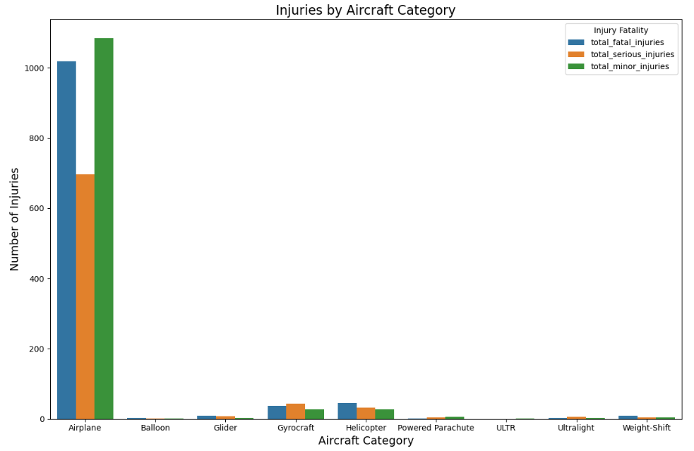
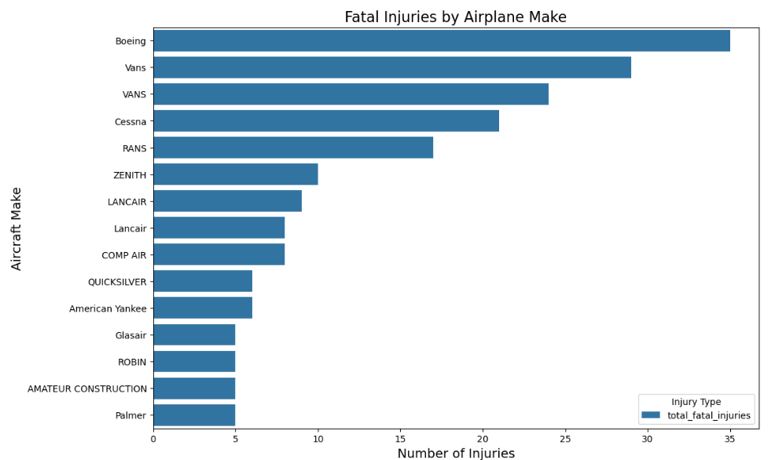
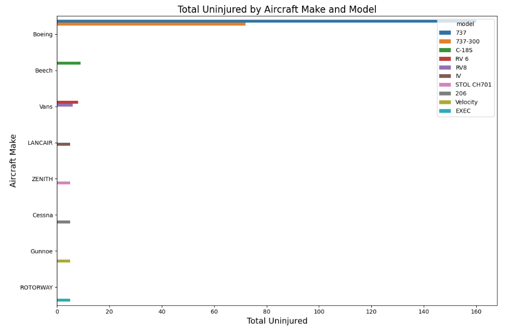
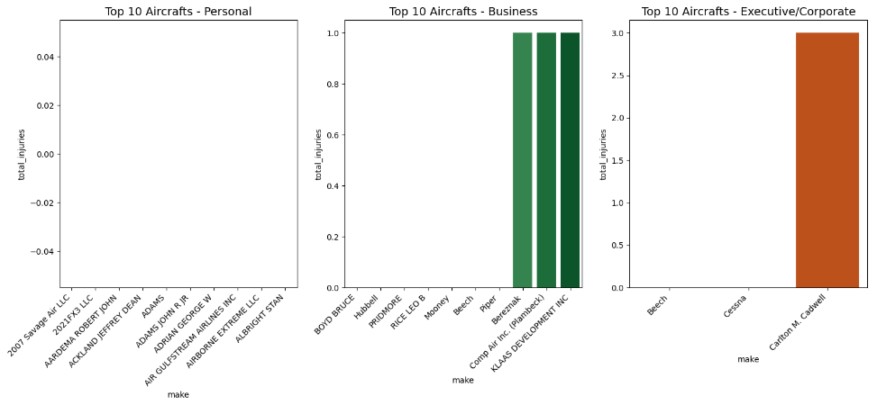

# Horizon Enterprise Aircraft Assessment Insights

## Overview

This projects analyzes the avaiation accidents since 1962, which contains informations about civil aviation accidents within the United States, its territories and in international waters. Insights from the analysis will enable Horizon Enterprise to identify safe, low-risk aircraft for Horizon Ventures, minimize operational risks, reduce negative publicity, and support the company's expansion into the aviation industry by ensuring safer, more reliable fleet acquisitions.

## Business Problem

Horizon Enterprises is seeking to expand into the Aviation and Aerospace Industry,specifically the Aircraft Operations and Fleet management as a means of diversifying their portfolio. The goal is to ensure business continuity, minimize financial risks, and optimize fleet performance.

## Data

The National Transportation Safety Board,an independent U.S. government agency responsible for investigating and determining the probable causes of transportation accidents, provides information from 1962 and later about civil aviation accidents within United States, its territories and in internation waters. The data files provide the event dates, location, aircraft category, make, model as well as other plane features.

## Methods

In this project, we use descriptive analysis to explore historical data on aircraft performance, accident rates, and safety records. This allows for the identification of key trends and patterns in aircraft reliability and safety outcomes over time

## Results

Airplanes have the most number of recorded injuries accross all the aircraft categories. 
Some airplanes have a high number of total injuries but also have high number of non-injured e.g Boeing







## Conclusion
Based on the analysis done, Horizon Enterprise should focus mostly on airplane as they are the most common in the dataset, based on the freuquency of their occurence in the data. For

- **Executive/Corporate flight purposes, the Beech 18 and Cessna, had the lowest rate of accidents, and are the most common
- **Business flight purposes the listed makes are the most common and have the least number of accident occurences and total number of injuries (BOYD BRUCE, Hubbell, PRIDMORE, RICE LEO B, Mooney, Beech, Piper, Bereznak, Comp Air Inc. (Plambeck), KLAAS DEVELOPMENT INC)
- **Personal flight purpose the following had the least total injuries and are widely used in the sector (2007 Savage Air LLC, 2021FX3 LLC, 5 RIVERS LLC, 781569 INC, AARDEMA ROBERT JOHN, ABBETT GERRY, ABBEY VICTOR, ACKLAND JEFFREY DEAN, ACRO, ADAMS)

### Next Steps
More data could enable to make more informed choices especially with regards to

- **Total Cost of Purchasing and Operating the Aircraft: More data on the upfront purchase price and ongoing operational costs (like maintenance, insurance, and fuel) would enable a more informed decision on the total cost of ownership

- **Number of Passengers it Carries: Additional data on the seating capacity and passenger demand would provide insight into which aircraft best meets your operational needs, and this also affects the survival and injury rates data of the aircraft

## For More Information

See the full analysis in the [Jupyter Notebook](./Horizon_enterprise_aircraft_insights.ipynb) or review this [presentation](./HorizonEnterprises.pdf).

For additional info, contact John Mugambi at [ohn.mugambi@student.moringaschool.com](mailto:john.mugambi@student.moringaschool.com)

To view the Tableau dashboard, go to [Tableau Dashboard](https://public.tableau.com/views/ACCIDENT_17324309776450/Dashboard1?:language=en-US&publish=yes&:sid=&:redirect=auth&:display_count=n&:origin=viz_share_link).

```
├── data
├── images
├── README.md
├── AHorizonEnterprises.pdf
└── Horizon_enterprise_aircraft_insights.ipynb
```